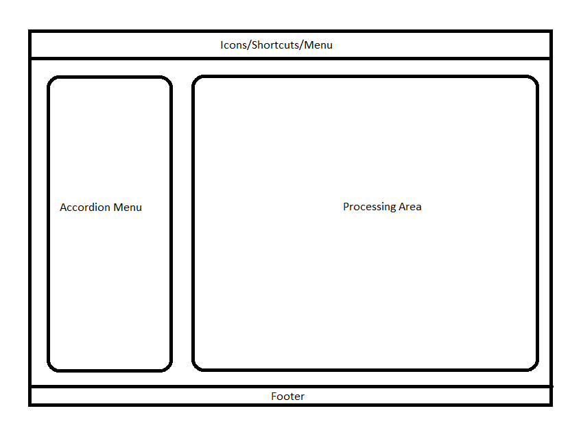
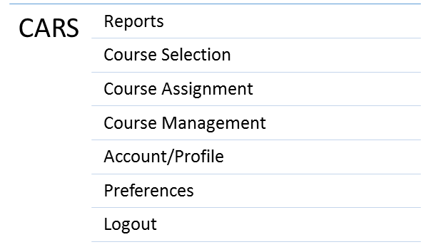
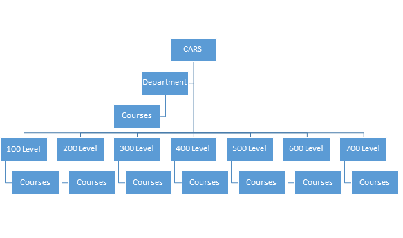

<a name="env"/>
## Setting up the Dev Environment

<a name="install"/>
### Install and Configure
#### Install Dependencies
* Download and install Composer
    * Find instructions on their [website](https://getcomposer.org/doc/00-intro.md)
* From the root of the project run `composer install` to install dependencies

#### Create Database
* Connect to MySQL and run the `db/cars/sql` script to create the database
* Optional - run the `db/dev_data.sql` script to load some initial data into the database

#### Configure Application
To make changes to the default configuration, make a copy of `app/src/settings-default.php` and place it in `app/src/settings.php`
1. Set `displayErrorDetails` to `false` to suppress technical data in errors
1. Change the log level to `DEBUG` for detailed logs
1. Change DB connection user and password
1. Make sure `authType` is set to `dev`
    * _Note: Setting this to `dev` will disable any password authentication - **Never do this in production!**_

<a name="conf"/>
### Local Authentication
* When using development login, no password is needed to log in as any user existing the database

<a name="app-structure"/>
## Application Structure

<a name="layout"/>
### Layout
The overall page structure and layout is shown here:


<a name="nav"/>
### Navigation Menu
The menu structure and hierarchy of the application is:


<a name="nav-course"/>
### Course Menu


<a name="slim"/>
### Slim Framework
* This application is structured using [Slim framework](https://www.slimframework.com/docs/)
* Application routing is handled by the Slim router
    * API routes defined in `app/src/routes_api.php`
    * Routes for views (pages) are in `app/src/routes_views.php`
* Authorization is handled in middleware so it can be applied to multiple routes
    * Method can be found in `app/src/middleware.php`
* All pages are rendered using Slim's templating function
    * Template files can be found in `app/templates/`
    * Variables are defined and passed to templates as an array in the 3rd argument of the render function in `app/src/routes_views.php`

<a name="class"/>
### Class Structure
* All business rules are checked and applied in the business layer classes
    * One class per application function (request, assignment, reports, etc)
    * Common operations are in the `Common` class
    * Classes are in `app/src/Cars/Business`
* All database actions take place in the data layer
    * Structured similarly to business layer
    * Classes arein `app/src/Cars/Data`

<a name="db"/>
### Getting a Database Connection
* A PDO database connection exists in the project dependencies
    * Connection parameters must be configured in [[settings.php|application-installation#settings]]
* Calling `$this->db` will return a PDO connection object
    * `$app->db` in methods where `$this` context is lost

<a name="logger"/>
### Using the Logger
* A logger also exists in the dependencies and can be accessed with `$this->logger`
    * `$app->logger` in methods where `$this` context is lost
* An info log message would look something like this
```php
 $this->logger->info("Something interesting happened");
```
* Log file located in `app/logs/app.log`
