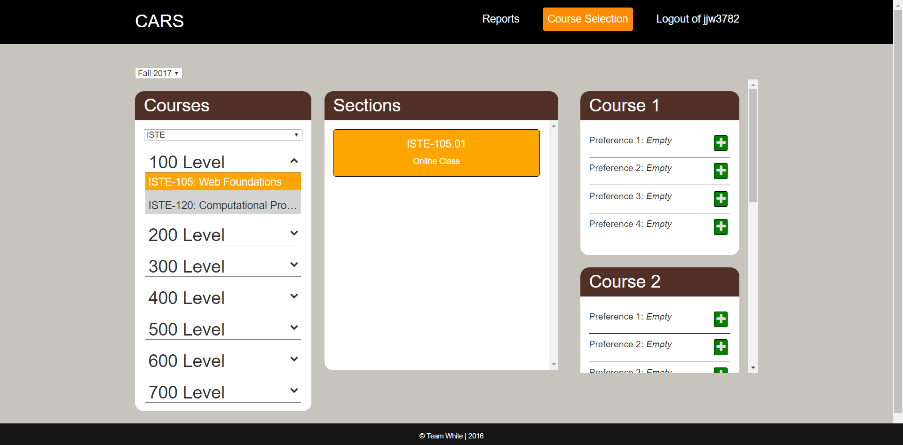
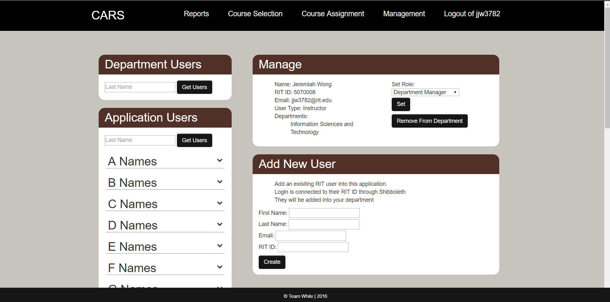

# CARS - Help
* [Connecting to the Application](#connect)
* [Using the Application](#use)
    * [Course Selection](#selection)
    * [Course Assignment](#assignment)
    * [Reports](#reports)
    * [Course Management](#manage-course)
    * [Department Management](#manage-dept)

# Connection to the Application
## URL

You must connect to the application using the following address:
https://white.ist.rit.edu/

## Authentication

User will be redirected to the RIT Shibboleth Login page.
Log on to the application by using the RIT Username or RIT computer account that was assigned to the user and the password that is set for that account.

If login information is incorrect then user will be given an error message: "Your username or password are incorrect. Please try again."

Unauthorized users will be redirected to a page stating they are an unauthorized user.

## Using CARS

### Course Selection
The course selection page is accessible to all users. Users will be able to select a maximum of up to four courses. First select a term (e.g. Fall 2017) then select the department of the course for that term. Use the drop down menu to view courses from each course level. Lowest level courses are 100 level while highest level courses are 700 level. Once users select the course the available sections will be displayed in the "Sections" box. Then select the section of the course by clicking on the section which will be displayed under the "Sections" box. When the section has been clicked, "+" buttons will appear within the "Course #" boxes to allow users to add the section for each of the four courses. Users may add the course as a first, second, third, or fourth preference for a course. Adding multiple courses to the same "Course #" box lists the user's preference for a course. Users may have multiple preferences for one course selection, the number of preferences is configurable during the application installation process. If no preferences are selected then the preferences slot will be shown as _empty_. After users have added the section as a preference, the "+" button will change into a delete button for users to remove the selected section if needed. The steps are outlined as shown:

Once all courses and sections have been selected, the courses will be made available in the Course Assignment page for department chairs to start assigning courses to faculty members.

### Course Assignment
The course assignment page is accessible to department chairs only. Department chair will first select the term (e.g. Spring 2016) then select the department of the course you want to assign. Use the drop down menu to view courses from each course level. Lowest level courses are 100 level while highest level courses are 700 level. Once department chair selects a course then the course sections will be displayed. Department chairs are able to select multiple courses at a time for assignment. If there are no sections available for that term the default message: "This class has no section information for this term" will be displayed. Each course section will have the name of the faculty member(s) who have selected the course from the Course Selection page. Each course listed in the "Courses" drop down menu will have an indicator that is either yellow or green. The yellow indicator means the course is unassigned to any faculty member(s) and a green indicator means that the course is already assigned to a faculty member. Each section of a course shown will notify the department chair of a faculty member's preference when that faculty member selected the course from the Course Selection page. Course sections displayed will also notify the department chair of any selection conflicts when two or more faculty members have selected the same course section. The steps are outlined below:

### Reports
The reports will show the room schedule and the user assigned schedule for courses. For User Assigned Schedule report, first select a term (e.g. Fall 2017), then select a department (e.g. IST), and finally select the user (e.g. last name, first name). When the Get Report button is clicked the assigned schedule for that user will be displayed organized by day of the week (Monday-Saturday) with information such as course information, start time, end time, and room location. For Room Schedule report, first select a term, then select the building (e.g. GOL), and finally select the room number that is located in that building (e.g. 2620).

User Assigned Schedule report:

Room Schedule report:

### Course Management
The course management page is accessible only to department chairs and department managers. Department chair or department manager will first select the course department (e.g. ISTE, NSSA, HCIN) then select the course that needs to be added from the drop down menu. Drop down menu will display courses from each course level. Lowest level courses are 100 level while highest level courses are 700 level.

Department chair or manager first adds a new course using the Add Course form by clicking on the "Add Course" button below the drop down menus. The form is shown below:

Once department chair or department manager select the course from the drop down menu the course information will be displayed in the "Manage" box. Course information includes course code, course number, number of credit hours, number of class hours, number of lab hours, and a course description.

Department Chair or manager can select the course term from a drop down menu in the "Sections" box to view the course sections for that specific term. If a course does not have a section in a term, the default message: "This class has no section information for this term" will be displayed. The department chair or manager can then add a new course section for a term using the Create Section form by clicking on the "Create Section" button in the "Sections" box as shown:

After all necessary information has been entered into the form then the new section will be displayed after clicking the "Save changes" button. The new section added will be shown when the appropriate term has been selected.

All courses and sections added in the Course Management page will be available in the Course Selection page when users select the appropriate term (e.g. Fall 2017) then the appropriate courses and sections added to that term will be made available to select.

### Department Management
The department management page allows the department chair and department managers to add new users, view department users, and view application users. Department chair or manager must first add a new user by entering the first name, last name, email address, and RIT ID number into the form. After the Create button is hit, then the new user will be added to the list of Application Users which is organized by last name. Department chair or manager can either find and select the users name from the list or search by last name to get all users with that particular last name and select it from the list. Once the user is selected then the user's information will be displayed in the "Manage" box. User information includes full name, RIT ID number, email address, user type, and department. The department chair or manager will then be able to assign a role to that user, roles include department manager, instructor, adjunct, and student employee. Then the user can be added into a department (e.g. Information Sciences and Technology). After the user is successfully added into the department, the department chair or manager can remove the user from the department by clicking the Remove From Department button if needed. The steps are shown below:

